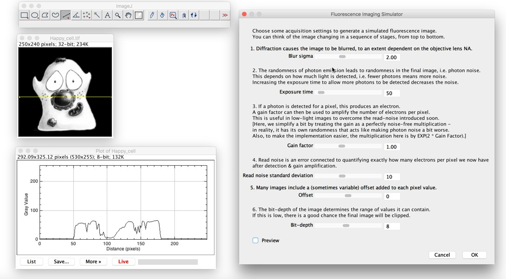
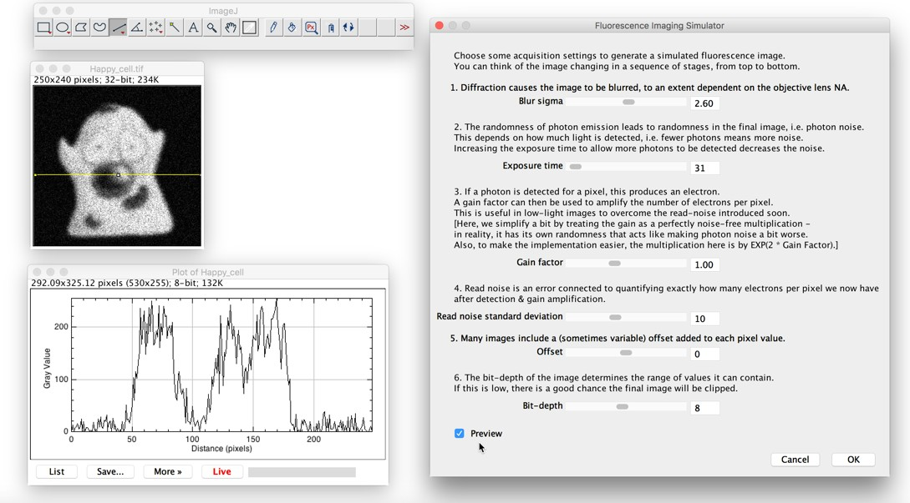

# Fluorescence imaging simulator
This is a simple ImageJ plugin to simulate blur and noise from fluorescence imaging, and also the impact of adjusting several microscope parameters.

### Download
The plugin can be downloaded [here]([fluorescence-simulator-1.0.0.jar](https://github.com/petebankhead/fluorescence-simulator/releases/download/1.0.0/fluorescence_simulator-1.0.0.jar).

### Installation
First you will need to install either [ImageJ](https://imagej.nih.gov/ij/) for [Fiji](www.fiji.sc).

The plugin is then installed using the normal approach for ImageJ, as documented [here](http://imagej.net/Installing_3rd_party_plugins).

In summary, this means simply put the Jar file ([fluorescence-simulator-1.0.0.jar](https://github.com/petebankhead/fluorescence-simulator/releases/download/1.0.0/fluorescence_simulator-1.0.0.jar)) inside ImageJ's plugins folder.

### Usage
To run the plugin from within ImageJ, simply open a (single-channel, grayscale) image and run the *Plugins &rarr; Simulation &rarr; Fluorescence Imaging Simulator* command.

A rather large dialog box then opens, giving a number of parameters to change.  These are intended to help give a feeling for how varying parameters during fluorescence microscopy image acquisition can impact the image quality.

For learning purposes, it can be helpful to generate a histogram and/or profile plot on the image prior to running the plugin, and set these to 'Live' mode.  Then running the plugin with 'Preview' turned on enables interactive exploration when trying different parameters.

#### Running the plugin

#### Running the plugin with *Preview* selected

### Further information
For more background information, see Chapter 18 of my [fluorescence microscopy image analysis handbook](http://go.qub.ac.uk/imagej-intro).

